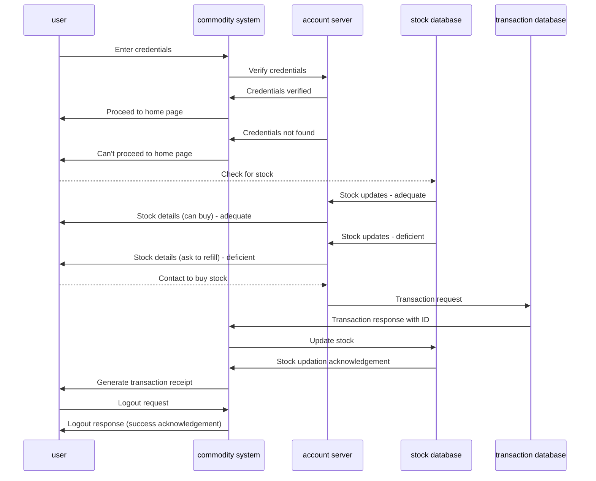

```mermaid
sequenceDiagram
  participant user
  participant commodity system
  participant account server
  participant stock database
  participant transaction database
  user ->> commodity system: Enter credentials
  commodity system ->> account server: Verify credentials
  account server ->> commodity system: Credentials verified
  commodity system ->> user: Proceed to home page
  account server ->> commodity system: Credentials not found
  commodity system ->> user: Can't proceed to home page
  user -->> stock database: Check for stock
  stock database ->> account server: Stock updates - adequate
  account server ->> user: Stock details (can buy) - adequate
  stock database ->> account server: Stock updates - deficient
  account server ->> user: Stock details (ask to refill) - deficient
  user -->> account server: Contact to buy stock
  account server ->> transaction database: Transaction request
  transaction database ->> commodity system: Transaction response with ID
  commodity system ->> stock database: Update stock
  stock database ->> commodity system: Stock updation acknowledgement
  commodity system ->> user: Generate transaction receipt
  user ->> commodity system: Logout request
  commodity system ->> user: Logout response (success acknowledgement)
```
