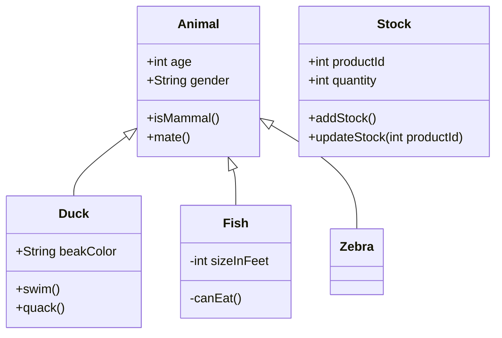

```mermaid
classDiagram
      Animal <|-- Duck
      Animal <|-- Fish
      Animal <|-- Zebra
      Animal : +int age
      Animal : +String gender
      Animal: +isMammal()
      Animal: +mate()
      class Duck{
          +String beakColor
          +swim()
          +quack()
      }
      class Fish{
          -int sizeInFeet
          -canEat()
      }
      class Stock{
          +int productId
          +int quantity
          +addStock()
          +updateStock(int productId)
      }
```
