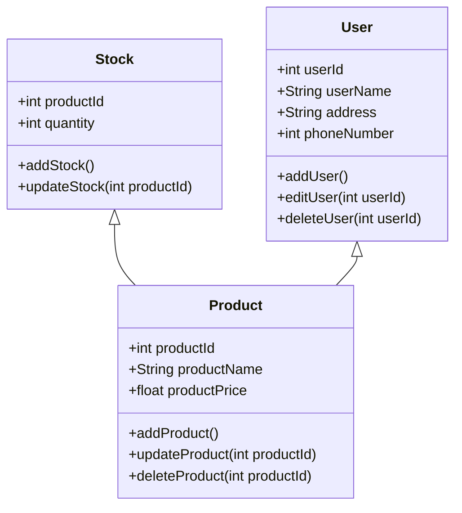

```mermaid
classDiagram
      Stock <|-- Product
      User <|-- Product
      
      class Stock{
          +int productId
          +int quantity
          +addStock()
          +updateStock(int productId)
      }
      class Product{
          +int productId
          +String productName
          +float productPrice 
          +addProduct()
          +updateProduct(int productId)
          +deleteProduct(int productId)
      }
      class User{
          +int userId
          +String userName
          +String address
          +int phoneNumber
          +addUser()
          +editUser(int userId)
          +deleteUser(int userId)
      }
```
